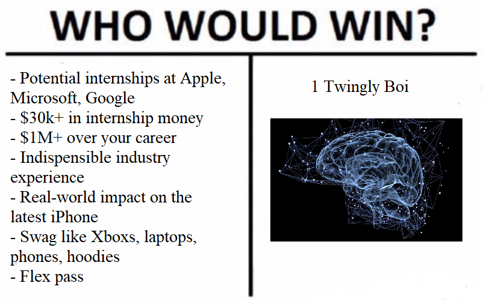
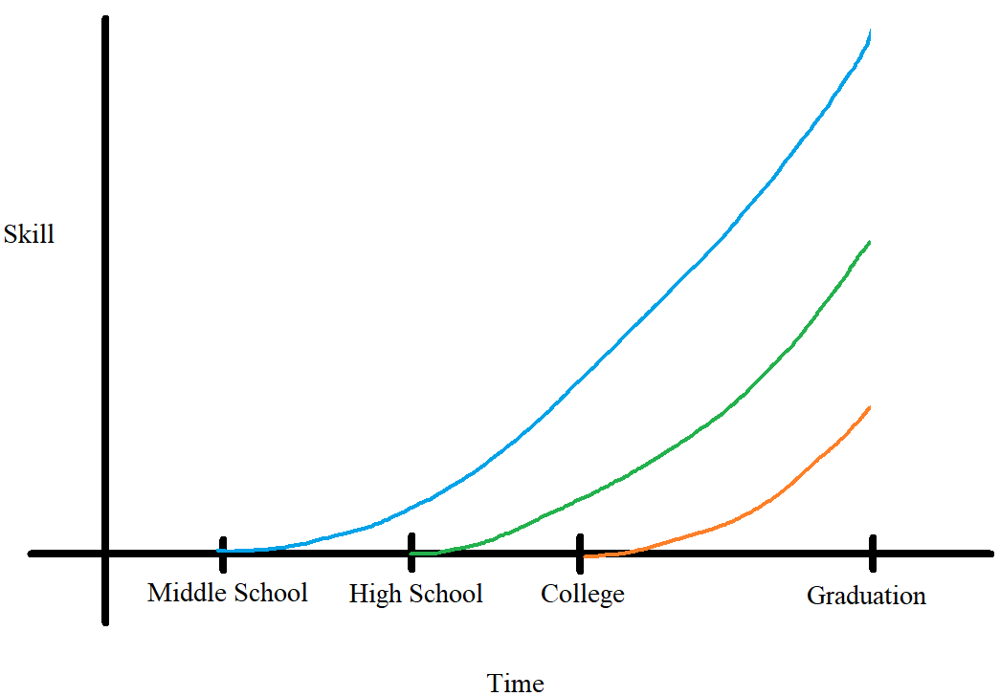
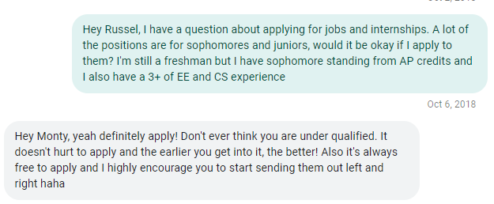

Do a quick Google search for ["how to get a software engineering internship"](https://lmgtfy.app/?q=how+to+get+a+software+engineering+internship) and ["how to get an electrical engineering internship"](https://lmgtfy.app/?q=how+to+get+an+electrical+engineering+internship). The software engineers (SWE) get tons of online resources, blog posts, communities, etc. detailing every step of the process, all the tricks of the trade, while we get next to nothing. Well not anymore! I've followed these types of posts in the software engineering (SWE) community for a long time and they've been super helpful to myself and tons of others. This **EPIC** guide will put all those SWE write-ups to shame and share basically everything I know about the entire internship process based off of my experiences landing offers at [insert obligatory internship post flex companies here] Facebook, Apple, Amazon, Nvidia, Qualcomm, Microsoft, Northrop Grumman, and more through 100+ interviews and 500+ applications.

I have *tons* of stuff to write about, so I'm splitting this up into a few posts. I didn't originally intend for that, but at the time of writing this paragraph and making the decision to split this post up, this post has already amassed nearly 20,000 words/40 pages/~80 minute read and I'm not even halfway done yet. Long webpages are just annoying to deal with as a user and can compromise performance at the same time. I'm anticipating for this post to be around 50,000 words/100 pages, but I'm not sure how much that means considering that I initially projected this post to be less than 10,000 words. Here are the different sections with links to each one as they go live: 

1. The Internship Mindset (this one!): Why do you even need an internship? It's so intimidating!
2. Pre-Application: There are so many things to do before even sending out your first application
3. Your Application: What your application needs and how can you stand out
4. Applying: How to spam applications
5. That awkward time between applications and interviews: Scheduling interviews, dealing with recruiters, coordinating timelines, it's all here!
6. Interviews: Cracking the EE interview!
7. The Offer!: Receiving an offer may not be the end yet
8. Closing: Final and misc. thoughts

# Disclaimers

By existing, you agree to donate 90% of your lifetime earnings to me for all eternity throughout the universe until the end of time. Just kidding LOL but there are a few nuances that I want to address because EE is a very broad field and everyone's situation will be different. Be sure to keep these in mind when reading this guide.

## My Experience

First of all, this post will be based off of my experience, so there's going to be tons of inherit biases there. The internship process may differ between industry, company, country/location, etc. but my internship search experience is pretty broad and I'll be able to capture and document quite a bit. 

Most of my experience is at big tech companies and I've also interviewed and landed offers at semiconductor, defense/aerospace/space, self-driving/automotive, networking, and robotics companies, all in the US, so if you're also shooting for those, well you're in luck. If not, be sure to keep that in the back of your mind when reading this. For example, when I go over projects and you're looking to get into the power/energy industry, that might not be as applicable to you. I'll do my best to point out areas where I lack experience and information so you know when and where to do more research. 

Additionally, I'm based in the US and I'm working on my undergrad in California near Silicon Valley (SV). International students may have a different process for internships in their country and there are many more hoops to jump through to land an internship in the US. Grad students may also have a different experience, especially if you're more specialized and/or applying for lab- or research-based positions.  

That being said, most of this advice will be highly applicable to you, no matter what industry you're going into, but obviously some more than others. Some of my advice around resume-writing and interviews for example extend beyond EE. Just like everything you read on the internet, take this with a grain of salt and remain thoughtful of what you want to implement and what you want to ignore.

## Don't Compare Yourself to Others

If you hit all of these points throughout the entire post, you're in *very* good shape. But if not, don't feel discouraged or that "I'm not good enough". You wanna hear a secret? There are a ton of points here that I don't even hit. This guide is sort of the 'light-at-the-end-of-the-tunnel' thing, an ideal to strive towards. Identify what you're missing and use this guide to build your skills and become a killer applicant.

So don't feel discouraged that you're not in the 99.999999th percentile of EE students implementing each and every one of these points to their absolute perfection. There's only one thing you should compare yourself to and that's yourself from yesterday, not some random post on the internet from some random internet stranger. 

You're going to see your classmates and friends landing internships left and right, and again, don't compare yourself to them. I get it, we're in college and we always compare ourselves to others and stuff. But at the end of the day, remember there's only one person you should compare yourself to and that's yourself from yesterday. And if your friends and classmates are landing amazing internships, that's great! Go leech off them LOL. 

## Similarities to SWE

I will be drawing many comparisons to the software engineering (SWE) process because their processes are very similar to our's, but they just have way more resources. For the longest time, I actually had my career set on being a software engineer (SWE) and I still remain quite active in the SWE communities. If you want more tips and stuff, you could also read up on those SWE posts and 95% of their information will be directly applicable to you as an EE, especially if you're looking to get into tech. I will point out many of the key differences throughout this post as they come up so you get a good idea of what to ignore and what to take in. 

Alternatively, if you find out that you actually want to go into SWE as a result of this post, well more power to you!

That being said, the inverse is also the case, this guide also has tons of information that will be super helpful to SWEs. Here are some of the biggest differences between the SWE and EE internship process, I've been through both at FAANG and can provide some insight:
- SWEs have a standardized interview process, basically coding riddles that you can grind on a website called Leetcode (LC), EEs we don't. 
- SWEs get more online assessments (OAs), basically online coding challenges/LC before the interview that act as another set of filters between your application and the job. I've only ever had OAs twice for EE roles.
- FAANG/AFUNGALMASS (Acronym for top companies: Facebook, Apple, Amazon, Netflix, Google/Amazon, Facebook, Uber, Netflix, Google, Apple, Lyft, Microsoft, Airbnb, Snap, Stripe) are often the target companies for most SWEs while for EEs, this isn't really the case. EE is a much broader field, there are less opportunities in tech and many people also shoot for positions in defense, semiconductors, aerospace, utilities/power/energy, biotech, etc which are often "looked down upon" by SWE students and don't offer as attractive salaries.
- EE is much more textbook heavy, our EE concepts are based in physics and math and involve tons of calculus, linear algebra, differential equations, etc. while for SWEs, there's very little math/textbook info required for almost all jobs outside of data structures and algorithms for the interview. Some EE interviews actually expect you to solve complex, mathy transforms or at the very least, solve some circuits.
- Every SWE and their mother has been coding since the womb, coding is much easier to pick up on your own that EE.
- There are way more SWE opportunities out there and way more CS students applying to them.
- There aren't too many EE career communities and resources out there.

Anyways enough of the fine print let's get going to the real stuff!

# Why Do I Need an Internship? 

In my experience, EE students don't hold that same sense of rigor and determination to land internships compared to SWE students, we don't really have that same culture. This culture can be pretty toxic, especially among college-aged students, but there are a tons of benefits as well. 

If you were previously not super motivated to pursue internships, I hope these can convince you otherwise. If you're already super motivated, I hope these push you more!

## Money

I always like to mention money first because so many students (myself included!) get really motivated when they learn how much money is on the line. Just another disclaimer before I get into the numbers, these are the top-of-the line figures that are very competitive with limited seats. Again, don't get discouraged if you're not here yet! I hope these figures help to motivate you to become the best engineer you can. 

Additionally, many students earning these levels of compensation are typically have a few internships under their belt, and most of the times, their earlier internships weren't paying this much. They busted their ass off to climb the "internship ladder" and that's completely normal so don't get discouraged! Even if your first internship doesn't pay as well, you have a still have a very good shot at landing these in the future! 

### The Numbers

Now with that's out of the way, let's get into some actual numbers. Here's what the  compensation breakdown looks like for my return intern offer at Microsoft (which was SWE, but HWE/EE gets the same TC):

- $8500/mo (~$53/hr) salary 
- $5000 signing bonus
- $7000 housing stipend (post-tax)
- $1500 transportation + relocation stipend

All in all, that's $39,000 for just one summer, which prorates to $156,000 for an entire year. Imagine how much crack you can buy with that! That's over twice the average salary for an entry-level, full-time EE. I'd say that's quite a step up from minimum wage. Now imagine you intern at Microsoft for three or four summers, that's well over $100k you'll be making even before you graduate. 

The best part is Microsoft/FAANG (an acronym for the "top" tech companies (Facebook, Apple, Amazon, Netflix, Google), typically some of the best paying) isn't even the highest paying. There are hedge funds/HFT firms out there that pay over twice this for a *very* select few interns (yes, there are some interns making $20k+/mo). These opportunities are *extremely* competitive and more selective because there are fewer opportunities. 

### SWE vs EE

Unlike for SWE, there aren't many resources out there to explore EE intern compensation. Here are a few resources for SWE intern compensation, just know that at the same company, EE interns will make slightly less than their SWE counterparts, and this difference extends throughout the entire career.  

For example, At Apple, a first-time EE intern gets put at the $36-$40/hr band while a first time SWE intern gets at the $41-44/hr band. This is similar at Facebook as well where the EE interns get $7k/mo while the SWE interns get $8k/mo. At Microsoft, SWE and EE interns and new grads (NGs) actually receive the same compensation, but this isn't very common, Microsoft is the only company I know that offers this. 

### Explore More Numbers

Explore intern compensation: 

- [levels.fyi internships](https://www.levels.fyi/internships/): Levels.fyi is an awesome website to explore compensation. I think it was originally intended for SWEs, but as it got more popular, they expanded to other fields as well. I will talk about them more during the compensation section, but here you can browse SWE internship salaries, keeping in mind the points above. 
- [Reddit](https://www.reddit.com/r/cscareerquestions/comments/kcthwn/official_salary_sharing_thread_for_interns/) [r/cscareerquestions](https://www.reddit.com/r/cscareerquestions/comments/isfzuz/official_salary_sharing_thread_for_interns/) [intern](https://www.reddit.com/r/cscareerquestions/comments/gufum4/official_salary_sharing_thread_for_interns_june/) [salary](https://www.reddit.com/r/cscareerquestions/comments/fc8cp9/official_salary_sharing_thread_for_interns_march/) [share](https://www.reddit.com/r/cscareerquestions/comments/e4ve4m/official_salary_sharing_thread_for_interns/) [threads](https://www.reddit.com/r/cscareerquestions/comments/cylp5r/official_salary_sharing_thread_for_interns/): Sweaty CS students on Reddit post their SWE internship offers. These figures are accurate for the most part. Again, these are SWE salaries to keep in mind the points above. 
- Glassdoor: glassdoor is ok for internships, but it's absolutely terrible for full-time engineers (FTE) because it fails to capture other components of compensation. I only use Glassdoor as a last resort.

And you think interns get paid a lot - now imagine the FTEs. Of course FTEs get paid more, there are plenty of $200k+ TC packages for new grad (NG) FTEs and it's going to be these internships that make you a competitive application and achieve these compensation figures. I won't drop any FTE numbers here, but check out the [levels.fyi data on it](https://www.levels.fyi/comp.html?track=Hardware%20Engineer). 

Here was a bit of info on compensation that was meant to entice you, but there's a dedicated section later on that goes more in-depth. 

## Experience

The experience gained during an internship is actually way more important than money, but I find that talking about intern comp turns more heads than gaining experience. Maybe us college students don't have our priorities straight, but you can be the judge of that. 

### Hands-On Experience

As you can probably imagine, working in the industry is actually pretty different from school. I don't know of any engineers grinding Laplace Transforms at work, but how many LTs did you do in school? Having hands-on experience is incredibly valuable as I'll detail later. 

Unlike for SWE, you it's very difficult to get hands-on experience on your own. I'm not sure about you, but I personally don't have a $500k lab setup in my bedroom. At this point in our lives, the only way to get lab experience is at school or at work, and apparently not every school offers a ton of hands-on lab exposure. 

The information taught at school is typically pretty disconnected from the industry. My school doesn't cover communication protocols, PCB design, DC-DC converters, and motor drive design, and even when they do, it isn't until like senior year or grad school. Students with only academic experience would have trouble answering common hands-on/practical knowledge-based interview questions like "What's the difference between I2C and SPI?" or "Design a circuit to drive a motor from a microcontroller" because those sorts of things just aren't taught in school. 

I can't really fault the school for this, but practical information like this can really only be picked up through personal projects and industry experience and are pretty critical to passing interviews. They're also critical for the job, but you can pick them up during the job, that's much harder to do during the interviews. And even when you can pick it up during the job, I'd prefer to maximize my on-the-fly learning focused on more job-specific information.

### Impact

Companies recognize the value of interns and that turning interns into productive engineers ends up benefiting the company/team in the long run. That's why these internships aren't your coffee boy internships (it's a shame I even need to mention that, so many people think they are). At these internships, interns have real opportunities to make impact. For example, at Microsoft, I the code I wrote got productized and shipped out to the final product to do cool stuff I can even say. We need to sign NDAs because we really do work on top secret stuff and learn about product roadmaps. iPhone interns actually work on the next-gen iPhones, you get the idea. It's just an awesome feeling to know that you built something that millions of customers will use. 

Interns typically work alongside FTEs and are delegated the same tasks and they get the real experience of what it's like as an FTE. It's in the company's best interest to get you accustomed to working there and put on real tasks to get you to return. 

### Exploring EE

EE is a *very* broad field. There's so much out there yet we have so little time at school to explore everything, our undergrad barely covers the fundamentals. Internships are a great opportunity to explore what you do and don't want to do in your career. You get a ton of hands-on experience and exposure to a wide variety of real-world topics and it's a great opportunity to pick and choose what you want to continue for your career and focus on in school. 

Interns have a great deal of mobility, we're in and out in three months, no obligations needed. That's why it's the perfect opportunity to explore everything. We know so little but we can learn so much when we're young. One summer go work at a startup, the next go to a big tech company, and after that to defense. Go explore PCB design one summer, computer architecture the next, and analog design after. When you go FTE, you don't get that same level of mobility. You can join a company FTE and leave after three months, see how that goes for you (life pro tip: don't do this!).  There are rotational programs, but that's exactly what internships are for. 

Knowing what you *don't* want to do is just as important as knowing what you *do* want to. I'd rather "waste" a summer doing something I thought I enjoyed but learning that I don't as opposed to actually wasting years of my career doing the same. 

Again, EE is a broad field and we can do a lot with our degree. When you get the "buffet", you figure out what you like and don't like, but none of that experience goes down the drain. You'll know what you like and don't like *at the moment*, but life is dynamic. In a few years when circumstances change, you may want to pivot your career. Your internship "buffet" experience can prove extremely useful in these circumstances where you can make a much better decision having actually experienced a few options. 

Maybe you did an internship at a startup and it turns out you don't like it *right now*, it was fast paced and you had a lot of freedom without the politics. The next summer you move to big tech and wow it's a blast! So you decide to go into big tech to start your FTE career but after a few years, it gets kinda dry and you want out. It's too slow for you and you feel bogged down by office politics. But wait! You did an internship a few years back at that startup free of these exact burdens! No experience is bad experience (ok not always, but you get the idea I'm trying to make here) and having all the background puts you in a very powerful position.

Remember, an internship is like an extended interview, and interviews go both ways! It's a way for your company to evaluate you but also an opportunity for you to evaluate your company. 

### Context

School is super conceptual and much of the material often feels disconnected from the industry, which is absolutely true. This isn't really a fault of our EE programs and education system, the conceptual background is very important to become a successful engineer. But when you understand the physical and practical context where those concepts get applied, it makes learning those concepts much easier. You actually feel motivated to learn the concepts, it feels less like you're grinding through some random math stuff and more like you're learning why a physical system you're familiar with works and behaves the way it does. 

Fourier Transforms can feel like annoying plug-and-chug math, but when you get to work with practical applications of the frequency space, gears begin to click and "Ah hah! That's where it comes from!". You begin to understand and appreciate the true beauty of all this "random, janky math" and the school's curriculum begins to make a lot more sense.

School gets way more interesting and fun and you begin to learn more and more after realizing that the school material barely scratches the surface of what's actually happening. You go far beyond the textbook and end up getting a much more valuable and enriching educational experience at no extra cost, just motivation and background!

## New Grad Compensation

As you complete more and more internships, you become a much more competitive applicant with valuable experience and and strong skillsets. Being a strong, competitive applicant gives you much more negotiation power to earn higher NG TC (total compensation). A company is of course going to prefer someone with more relevant industry experience and has previously proven themselves to be a successful engineer and will offer a higher TC accordingly. 

Additionally, you'll look more attractive to not only a one company, but many more. You'll begin to collect competing offers that opens up your options but also provides tons of leverage for negotiation. Most companies don't budge too much on TC, but once competing offers are introduce, things just got serious. It's common for NGs to negotiate their TCs up by tens of thousands, sometimes even over 100k, from competing offers. 

## Return Offers

Internships are like extended interviews, and if you perform well in your "three-month interview", there's a good chance you'll get a return offer! Return offers save you from the stress of another application season, but also offer TC benefits as well. Many companies offer higher TCs for returning interns. For example, Facebook gives high performing "Rockstar" interns a $100k *signing* bonus and the base Microsoft TC packages differ by $20-30k for returning interns.

Not all companies offer return intern bonuses, but still strong returning interns have more leverage during negotiations. A strong intern has already proven themselves to be a strong performer while some random NG entering through the standard interview pipelines is much riskier, the team doesn't know how well they'll perform. That "random NG" will be much riskier to invest in. There are interviews to assess their skillset and knowledge, but a "three-month interview" is a much stronger assessment than a regular two-day/five-round interview.  

It's also very expensive and time consuming to hire a brand new candidate. There are costs with the recruiter and all the time (and money) spend interviewing the candidate, so a previous intern who's skillset is a known is much safer and often prefered. 

## Career Growth

 I'm not anywhere in my career yet, so I can't offer too much insight on this section, but here are some general ideas I hear thrown around. Valuable internship experience can also help to skyrocket your career. The technical skillset and background gained through internship experience puts a strong intern candidate head-and-shoulders above their peers. A returning intern also already knows the ins and out of the company and can hop right into the deep end and start working on the cool stuff. A brand new hire will need learn everything and need lots of handholding to get up to speed. I've been told by recruiters and hiring managers that returning interns often outperform new hires because they're already familiar with everything and can hop right in. Finding your passion through internships helps to learn better faster in the job you most enjoy.

## Fun!

Internships are a blast! There's of course the technical side of things which I find a ton of fun, but there's also the *fun* fun stuff that not everyone may know about. Companies know that interns are young and energetic and they want to give interns an opportunity to explore the company and the surrounding area. They want to sell the interns on the company, they want the interns to return as happy, productive engineers. 

Companies host *tons* of awesome intern events, including but not limited to:

- Nvidia: Party at the CEO's epic mansion
- Microsoft: Intern day - interns get flown out to the HQ in Redmond for epic party + concert (with famous artists like Chance the Rapper, Chainsmokers, etc)
- Microsoft: Company-wide Hackathon
- Apple: Legit Q&A with Tim Cook at Apple's top secret, underground Steve Jobs theater
- Paintball
- Sports games
- Game nights
- Movie nights (Apple rented out entire theaters for us)
- Trips to nearby attractions like Yosemite, Lake Tahoe, etc. (for the Bay Area)
- Parties
- Amusement parks
- Rafting
- Go carting

Yeah I'm sure you get the idea by now. And many of those intern activities are typically paid for and everything. Unfortunately, Covid is meddling with a ton of these activities, but [here's another post I wrote on my internship experience at Microsoft, including all of the fun stuff!](http://montychoy.com/blog/my_remote_software_engineering_internship_experience_at_microsoft_summer_2020#fun_stuff)

In addition to the company-sponsored intern-wide events, there's so much more. Internships are basically a massive collection of the best minds all at the same age from all around the world living and working together - sounds kinda like school right? Except at internships, no one has homework and everyone has money so you can do all the fun stuff of school without needing to worry about exams or going broke. My friends took trips to Las Vegas, LA, Disneyland, etc. during their internships. Exploring California can be especially fun if it's your first time and you're from across the country or even from across the world. 

Many companies offer intern housing, meaning they give you an apartment/hotel to live in for the internship. I'll get more into this later on, but some companies like Apple basically rent out an *entire* apartment complex to house their interns.  Google used to this, but one time the interns partied too hard and it annoyed the neighbors, so they cancelled the housing program (I'm serious, look it up!). With all the interns living together, it's sort of like the social dorm life but most of the interns are in their junior year so they already know how to drink and hopefully people aren't stupid enough to shit in the showers. The apartments are nice and clean, so the experience ends up being as social as the dorms without the drawbacks.

## Swag

I was highly debating putting this section first instead of the Money section since college students love free stuff too, but I think people care *slightly* more about money over swag. 

Companies really want to sell you on their company because they want you to stay and attract the best talent, so they offer tons of swag. There's of course the standard stuff like stickers, pencils, and t-shirts, but also the cooler stuff like:

- Branded Hydroflasks
- Xboxs
- Surface/Beats Headphones
- Phones
- Laptops
- Hoodies/Jackets (Patagonia, North Face, etc)
- Backpacks (Timbuk2, Patagonia, North Face, etc)

In my other post about my [Microsoft experience, I also included a dedication section on swag. ](http://montychoy.com/blog/my_remote_software_engineering_internship_experience_at_microsoft_summer_2020#swag)

## Clout

We're young, this matters to us for some reason. Enjoy it while it lasts!

# Finding the Motivation

It's very difficult to land internships as a freshman or sophomore and especially as a high schooler, but there are still tons of things to get you ahead of the curve. Unfortunately, EE is a very textbook-heavy field where a strong understanding of math, physics, and EE concepts are necessary to perform well, and most of these aren't taught until like junior year. This isn't like SWE where you really only need to take one "sophomore"-level class to prepare you for 90% of SWE, and that class can easily be self-studied, no EE is *real* engineering (jk ofc). 

This will be emphasized so much: get started early. The best time to get started was yesterday, but the second-best time is *now*. If I could attribute my internship success to one thing that's under my control, it would be that I started early. 

## It's Intimidating

I get it, I was also in your shoes. Seeing those big, bearded, smart-looking EEs practicing sorcery is intimidating. "I'm not good enough". "I'll just try later when I get better". "Nobody wants me". Face-to-face/social networking events like career fairs exacerbate these feelings. These are all valid feelings. Everyone gets these feelings. My friend with a 4.0 GPA still gives me that "I'm not good enougggghhhhh" when she has a **4.0 GPA**. I still get these feelings. I have two top internships, tons of projects, and tons of passion, and I still feel inadequate. You were looking for tips from me on how to get past those feelings weren't you? Well if you find them, feel free to let me know because I'm also looking. 

Dealing with these feelings is different for everyone, but here are a few of my solutions. 

- Go with friends: Take advantage of our underdeveloped brains and out-of-control hormones and emotions and peer pressure yourself and your friends to go together. It gets much easier. Even just going to the career fair to walk around stealing swag is a great start.
- The first one is always the hardest: Just do one, and after that one, you'll realize it's not that bad. All that anxiety was artificial, and when then comes to light, it becomes much easier to manager. Also, it's actually pretty fun, just like crack.
- Just do it: Not going to lie, this is how I did it. I basically told myself "no balls" and went up to some random guy at the Apple booth during the career fair. A month later, I got the job!
- Companies give tons of free stuff: At career fairs, companies often give out tshirts, socks, snacks, chargers, notebooks, pens, pencils, and other small freebees. They want people to go to them, even if it's just to jack some swag LOL. They also know that many people are hesitant to attend for a variety of reasons, including those feelings of inadequacy. And once you go to that booth to jack that nice Hydro, since your there, you might as well give it a shot and talk to a hiring manager!
- Get drunk/high: When you're under the influence, your confidence shoots up tenfold. (Don't do this!)
- It's not your job to reject yourself: By not even going and applying, you're rejecting yourself. You're not even giving yourself the chance. It's not your job to reject you, it's the recruiter's. 
- Use the section earlier on "Why Internships..." to calculate how much money you're losing by not getting out there. If you get an internship this summer and next, that's a potential $50k in your pocket from just those two internships, another $50k/yr in your NG TC, and even more as your career progresses. That could be over a million dollars you're loosing out on just because of some random twiggly thingies in your brain!
- Even if it doesn't feel like it, these feelings will subside naturally. You get older, you get experience, and you gain the confidence to fight these back. But while you're experiencing them, you can either let yourself continue to be controlled by these invalid, irrational emotions, costing your career and wallet. Or, you can stop being a pussy and get out there. The more you put yourself out there, the more confident you become, and the less you'll be controlled by these feelings.
- Do a rational, cost-benefit analysis like this one: 

## We All Start Somewhere

Don't feel bad or intimidated that most of the upperclassmen around you know know more than you. That's just how things work. But let me tell you something, you're probably a good deal further ahead than them just by reading this post. A ton of EE students don't have this much internship application experience and you're getting all for free here! The fact that you're reading this post, especially this far down, shows a great amount of initiative and dedication and speaks volumes for your character. 

Instead, recognize that there are so many opportunities to grow. EE is a very broad and deep field, many people way smarter than both of us combined have spent their entire lives studying this stuff and there's still way more out there. Use this to humble yourself and as motivation to push yourself to learn more, but at the same time, don't underestimate yourself and put yourself out there because you never know what amazing opportunities are waiting for you right around the corner. 

## What's the Worst that can Happen? 

There's so much to gain yet so little to lose. What's the worst that can happen? You embarrass yourself in front of some random recruiter who sees 1000 people a day and won't remember you five minutes later? And what's the best that can happen? You land an awesome internship that catapults your career forward. That risk/reward ratio is off the charts, there's no risk and so much reward. 

## No Experience is Useless Experience

The best way to learn many things is to experience it yourself, and this is again true for the application process. This guide may serve as a reference for you, but keep in mind that this guide was based off of my experiences and there's a pretty good chance you're not me living through my exact same situation. 

Ultimately, you should navigate the application process in the best manner that fits you. Maybe this guide aligns well with that, maybe it doesn't. But the only way for you to find out is to go out there and learn by doing. Figure out what's the best way to approach the interviews based on your skill set and strengths. Play around a little, test out some of my advice and play with it. 

By going to the career fair, doing interviews, and putting yourself out there, you're going through that process and developing the intuition yourself by doing which is way more powerful than some random online thingy. You get a good idea of how things work and can better develop your own methods and strategies to tailor the experience to yourself and your situation. 

Even if you don't get an internship, you still have all of that valuable experience navigating the process and next year, you'll know exactly what to do. I'd rather spend my freshman and sophomore years learning the best approaches and applying them during my junior and senior year when the stakes are much higher. When you go to the career fair and start applying for the *first* time during your junior or senior year, you're going to have to learn the best approaches and apply them on the fly which makes everything much more difficult, especially when you're navigating  your junior year internship or new grad opportunities where these decisions can really drive the direction of your career. 

Talking to engineers and hiring managers is also a great way to get insight into the industry. You can talk about the working experience, culture, everyday challenges, etc of that industry, company, team, or line of work and this information can help drive your career decisions moving forward. 

## Preparing for the Future

In addition to the skills and experience acquired by putting yourself out there, you can also ask for tangible, technical skills and tips to implement now. Remember, companies want interns, they want you. If you don't meet the bar now, they always look forward to see you improve and come back next year even better than before. At the career fairs or interviews, ask them "what skills can I learn to become better for next year?" and they'll gladly give you advice on what to learn, what classes to take, what projects to work on, etc. because they are also looking for the best candidates, and this is an opportunity for them now to initiate that. Take that advice and run with it and there's a solid chance you'll be a killer applicant next time around. 

Companies often delegate the same recruiters/hiring managers to manage recruiting, hiring, and the career fair at the same schools. I often hear stories of freshmen going to a company at a career fair, but the hiring manager, after assessing the student, decides that the student doesn't meet the requirements but offers the students resources and tips on how to improve and make themselves a competitive applicant. Sophomore year, the student does the same and establishes a rapport with the hiring manager and by the time junior year comes around, that student is a perfect fit! 

The experience, insight, and information available at career events and interviews are just as important as the internship itself and these resources are available to everyone, you just need to take the initiative and go for it! 

## Experience Compounds

The sheer amount of advantage you can achieve just by starting out a few months or years is actually pretty insane. All that experience just keeps adding up faster and faster. Those projects you do in high school can help you land internships in your freshman year, and that internship helps you land even better internships in your sophomore year, and all that just compounds insanely fast, especially because internships are so valuable and internships don't come in big volumes. If you're a really *really* good student, you'll land three or four internships during your undergrad, while a good student may only land one or two. One internship already means a lot, now imagine three or four of them. Internship experience typically isn't linear, meaning that four internships often has way more than 2x the value compared to two internships.  

Even though this graph isn't scaled and doesn't account for all the variables or anything, I hope it demonstrates the main idea of how much advantage you're gaining by starting early, and this gap can be reflected in your TC and career progression. Experience and knowledge compounds, you use previous experience to get more experience. This doesn't account for internship experience or the vast amount of learning resources at your disposal while in college, which would further skew the data in favor of starting in middle school and high school.

## Getting Your Foot in the Door

When you start getting involved in the internship scene, there's a good chance, even if you're awkward like me, to come across engineers, hiring managers, recruiters, and other students and make valuable networking connections. You never know how valuable these connections can be down the line and the more you have, the better, especially when actual human interactions are pretty rare to to automated systems. Recruiters and hiring managers love it when underclassmen network with them, it shows so much dedication and initiative and it could be a pretty good indicator of that student being a killer applicant later on because they're starting this early. 

Here's a story that I hope seals the nail in the coffin for how important getting started early with networking is, especially as an underclassmen. This was during my first quarter at school only a few weeks in when I was still figuring out how to college. Microsoft held this "Demystifying the Technical Resume & Interview" workshop and I decided to attend because, well Microsoft. They also had free dinner and valuable insight on the whole interview process (well not as valuable and thorough as this guide of course!). After the event, they typically leave the floor open for networking and chatting, so I go up to a recruiter (who I later find out to be Cal Poly's Microsoft recruiter) and ask her genuine questions about putting my company on my resume. Well I chat with her and she sounds super interested! She invites me to find her at the Computer Career Fair the next day (which I'll go into later) and I also end up getting an interview at Microsoft!

Towards the end of our quick chat, she also introduced me Russell who had just finished up an EE internship with them ([he just posted a dope video on improving your resume!](https://www.youtube.com/watch?v=0JmdTN1bBOw)) and I remember him being super helpful to get that initial push of confidence and put myself out there. I left him on read but that's what he gets for taking six days to respond lol.

Fast forward almost exactly one year to October 2019 and I'm again searching for internships for the following 2020 summer. After getting discouraging career fair results, I decide to reach out to that same recruiter and try to use some good old nepotism to get myself an internship. I'm not sure how well it worked, but I ended up getting an internship so I'm not complaining. I like to think it wasn't the nepotism that got me the role, but the fact that I got rejected without any interviews from *every single* internship role I applied to this year at Microsoft, even with a return offer, indicates otherwise.

## PTSD

I know it's difficult to land an internship as an underclassman, here's another quick story that basically summarizes the trauma. I was at the career fair after my nine-month Apple co-op looking for internships. It was only my second quarter at school, so being the honest person I am, I claimed that I was a freshman, which was true. I go up to a recruiter the the Texas Instruments (TI) booth, hand her my resume, and do my elevator pitch: "Hi, I'm Monty, I'm a first-year - " and she cut me off after those first six words, handed me back my resume without ever looking at it, and dismissed me with "sorry, we don't hire freshman, company policy" and I believed it so I didn't get too upset.

Now that's not even the good part. The next quarter (I was still a freshman, it was my third quarter at school), I again went up to the TI booth, did my elevator pitch with no interruptions and landed an interview on the spot. I thought it was strange, considering how the previous recruiter dismissed me, but again, I didn't think too much of it. The interview went really well and at the end, I asked if they really had that "we don't hire freshman" policy and my interview said no. At this point, I was a bit upset but what happened in the passed happened, not much I can do about it so I continued on with my life. 

Apparently, since I went through the career fair, I needed to also apply online to get my name in the system and actually apply for a req, all that business stuff. They let me know that I'm applying kind of late, so there might not be too many applications open. My interviewer worked on power electronics which was one of my interests, so I went online to look for that role assuming they were hiring, but to my surprise, there were only like five postings, four of which were business/non-technical, the last one being some digital design stuff I wasn't interested in. Well shoot, they were out of roles because it's later in the application season. If I applied in the fall/if the recruiter didn't dismiss me after six words, I probably would've found something. I ended up applying to that one digital role, getting auto rejected, and to this day, I still get auto rejected from TI.

So that's the story of why I avoid telling people my year in school and if asked, I just tell everyone that I'm a junior (which is what it says on my online portal, so it's not a lie).

# The Company's Perspective

As interns and applicants, it can be easy to forget what's behind the face of these massive companies. I don't myself identify as a company, but maybe I can offer some helpful insights on the company's interests that may not be as apparent. I've been talking a lot about how companies want you and that sort of stuff, so let me elaborate. 

First of all, companies *want* you. They want interns. They want the most talented students to both continue their products that make them money and also to prevent the competition from poaching talent. They pay the big bucks, offer amazing perks, host awesome events; big companies invest in tens of millions of dollars every year into their internship programs to poach and retain top talent. 

For example, Microsoft hosts a few thousand interns over the summer, I've heard as high as 7,000. For the sake of estimation, let's say Microsoft hosts 3,000 interns in a summer, and each intern on average makes $7k/month. That's over $20 million/month Microsoft dishes out for their intern class for their salary alone, not accounting for other stuff like FTE mentorship and other FT employees to handle the interns, recruting/interviewing, intern benefits, events, support infrastructure, etc that can easily double or triple the $20 million/month salary estimation. 

In addition to retaining talent, these companies also want to train that talent. Remember how earlier, I mentioned that returning, trained interns progress their careers faster? Well this is also beneficial for not only the interns not also the companies as they get access to better trained, higher quality engineers that can come in and hit the ground running.

Companies aren't spending tons of money for nothing, they themselves also realize the value of internship programs and compete against each other, millions of dollars at a time, for the top talent. In many cases, the relationship between the company and the employee is very much symbiotic. The company knows that it's nothing without the employees and companies are smart enough to realize the value of highly skilled employees. Internships programs are a way to support that initiative, companies are smart enough to realize that a "small" investment in interns pays off many times over in the long run. 

# What's Next

This is a multi-part post, here are the other parts:

1. The Internship Mindset (this one!): Why do you even need an internship? It's so intimidating!
2. Pre-Application: There are so many things to do before even sending out your first application
3. Your Application: What your application needs and how can you stand out
4. Applying: How to spam applications
5. That awkward time between applications and interviews: Scheduling interviews, dealing with recruiters, coordinating timelines, it's all here!
6. Interviews: Cracking the EE interview!
7. The Offer!: Receiving an offer may not be the end yet
8. Closing: Final and misc. thoughts