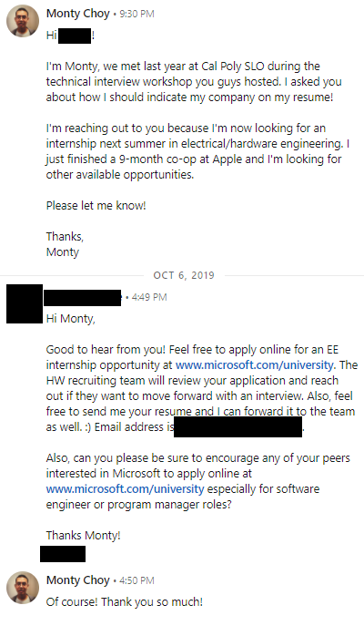

Even before you send out your first application, there are still a few things I'd highly recommend getting under your belt to make you a competitive applicant. That being said, don't feel like you need each and every single one of these to be a successful applicant, like I said I don't even have them all. These are sort of a guideline to help you build up your application and it's difficult to juggle schoolwork, extracurriculars, work, and everything. Keep building on everything in parallel, but be sure to consider the timeline. 

# The Pre-App Timeline

The earlier you apply, the better, but sometimes companies have their own hiring timeline that don't always align with everyone else. Be sure to keep the timeline into account when building your skills, sometimes you need to make a tradeoff between applications and skill-building. But don't wait and procrastinate. It isn't always worth it to wait a few weeks to wrap up that project before sending out applications because those few weeks can be the differnce between securing or loosing that dream internship. That balancing act between applications and skill building is difficult and different for everyone, which is why it's so important to start earlier and know what you're getting yourself into. Applications have a hard deadline with defined requirements, but your skill building does not.

As an example, one of my friends started setting up his application/resume in Decemember (which is already pretty late). He wants to wrap up a project or something before actually sending out his applications, which ideally would only take a few weeks max. Ok, not too bad yet right? Well fast forward three months to March or April (which is super late - never start applying this late!) and he still hasn't sent out any applications yet. Turns out, things took a bit longer than expected, but in this case, that boost he might've gained from that last project wasn't worth the three-month delay and I don't think he had anything lined up for the summer. He might've been a killer engineer, but that doesn't matter if you're late to the party. Stuff like this is why I always advise to start early, things pop up that may crunch your timeline and waiting a few weeks to perfect your application may not always be worth it. 

It's very important to apply early because many companies hire on a rolling basis, meaning they start hiring let's say in August, and once they're out of spots, they're out of spots, especially now with Covid where companies might not be able to afford massive intern classes. If you apply to that company in say November when their seats are almost full, it's going to be much more difficult for you to land that internship especially when considering the lengthy interview processes. I got burned by this a few times so watch out! 

Every company has their own timeline, so try to read up on that beforehand for your top companies. Some companies like Microsoft hire their hardware engineers from September - December, other companies like Google and Amazon wait until the winter, and other companies like Apple are team-dependant and will hire summer interns starting as early as the previous July all the way through the year. 

## Summer

Yep, that's right, the summer *before* that next summer's internship. A *whole year* in advanced is when you should start thinking about applications. The summer application season isn't as intense as the fall/winter, but be aware of the timeline. There isn't really a hard deadline for developing your skillset, but there is when it comes to internships. Many companies open up their applications in June - July of the previous summer and may even close in August or September school begins for you. 

Other applications may also open up in August or September which is still summer break for those of us on the quarter system. The unfair part is that those on the semester system may get evaluated earlier and get first shot at the available seats. Some companies like Microsoft have a certain amount of seats reserved for the quarter students who typically apply later, but I can't say the same for other companies. 

### Referrals

If you have friends doing internships, reach out to them for referrals during this time. They typically aren't doing their internship during the year and they usually need to be working to submit the referral. Additionally, many interns have their "grind time" during the last two weeks to wrap up their projects and prepare for presentations and may not have time to accommodate your referral, so as always, the earlier the better. I'll talk a bit more later on about referrals, but this is just about the timeline. 

### Off-Season Internships

Many off-season co-ops for the following Fall or Winter also open up during the summer. Off-season internships aren't as common as summer internships, so there isn't as much data on the timeline for these, but just remember, the earlier the better. Applying for these off-season internships may be helpful to get your foot in the door. 

This is purely speculative as this hasn't happened to me or anyone else I know, but if you land an off-season internship but get rejected for the summer position for whatever reason, there may be the opportunity to move that off-season internship to the summer. 

If you get invited for a phone screen/interview for an off-season internship, you have some recruiter contacts you can reach out to in the future. You also get an idea of how the interview process works (the more interview experience you have the better!) and if you don't perform up to par, you can always ask for feedback and improve to apply for the summer position a few weeks later with a great advantage.

### Leveraging Other Offers 

If you have a return offer, that return offer may have a deadline. This deadline can be a few weeks or even months after you complete your internship, depending on the company and even your school. If your return offer deadline is within a few weeks of your last day of the internship, that's a tough deadline to meet and make a decision. The whole interview process may take a few weeks and that might not be enough time to go through the entire interview process at your target companies. 

If you start applying during the summer, you have a better timeline buffer to get competing offers and decide where you want to continue at next summer. These competing offers can help with internship negotiation (yep that's a thing!) and just open up more doors for you. Some companies post their listings in the beginning of the summer but don't ramp up until late summer or early fall, and if that's the case, you might not get that same timeline buffer. Even if a company hasn't begun their recruiting pipeline yet, if you have the contact info of a recruiter or hiring manager, you may be able to expediate that process using a competing return offer as leverage. 

## Fall (August - December)

Fall and winter is when most of the applying happens, you should start applying here! Companies also want to start hiring earlier to poach the best talent. For SWEs, most of the applying is focused in the fall and extends a bit into the winter with most of the available positions considerably dwindling in the spring. During the holidays and breaks, hiring slows down so be sure to take that into consideration. Many companies begin hiring during the fall and have almost everything finalized by the winter, so be sure not to miss that window!

The exact timeline in the fall differs a bit by company, but I begin applying when school starts for me in mid-September and by this time, there ara already tons of postings out. This is pretty late so I'd actually suggest to start applying even earlier. In the fall, I typically apply up until around Thanksgiving time if I'm satisfied with my results, otherwise I still continue to apply. Interviews usually happen for me in October - November with a few extending out into December and offers come in November - December. That's a whole three to four months or applying but if I don't find anything good, I'll need to continue into winter.

And to further incentivize you to begin applying early in the fall and summer, here are some ballpark figures that will scare you away from beginning your application season in the winter or spring. If I had to best guess, I'd say that ~50% of EE internships are filled up by January. This means that if you start applying in January, your chances are basically half that of starting in August, and for your first internship, this can play a massive difference when you need everything you can get. And come spring when I'd guess that 95% of EE internships are filled, your chances are even worse. 

## Winter (January - March)

Ideally, you should have begun applying in the fall and your search has just extended out to the winter as well. If you're just starting to apply in the winter, you're not in the best shape but it's still recoverable. There are still a ton of opportunties avaiable during the winter, so don't get discouraged if you're still looking. 

For SWEs, there aren't too many opportunies left but still plenty remain. For EEs, I don't have exact figures but again there are still many opportunies available. At my school's career fair, there may be a few less companies but there are still a ton. A few companies also exclusively recruit EEs for summer internships during the winter including Amazon, Google, and a few teams at Apple. A team I'm in touch with at Apple recruits for their summer interns in the winter as the fall recruiting season is reserved for winter interns. I landed my Summer 2021 internships earlier that winter in February - March, so don't give up!

## Spring (March - May/June)

If you're still looking or just starting your search in the spring, you're sort of in trouble. There are typically very few opportunies left this close to the summer. I actually hear of people *starting* their search in the spring - don't do this!!! There are still a few opportunies left, but at this point most students have their internships secured. It's rare, but some bigger companies actually do their recruiting in the spring. I got an internship at Qualcomm in April, although I'm not sure if that's their regular schedule or just a Covid anomaly. 

At this point, I would recommend focusing your efforts on smaller and local companies that do have the flexibility to take on interns so close to their start date. There are a few big companies that do limited hiring, I would assume that's just to fill any last minute slots from renegs and other outstanding circumstances, but definitely don't bank on this. 

# What do you even want to do?

Again, EE is a massive field and there's so much out there. Figuring out what you want to do is difficult but it can be helpful to focus your explorations. Even just a "I want to work on spaceships" is good, you don't need to be super exact, and most of the times, you shouldn't be. You need to play a clever balance between what you want to do, what's available in your reach, and what's out there. You're going to have a tough time landing post grad-level EE research internships at CERN as a freshman for example. 

## Balance Your Focus

You don't always want to focus yourself on one super specific topic or area, especially for your first internship. For example, let's say you want to work on smart phones so you *only* apply to companies that make smart phones like Apple, Samsung, Huawei, Oppo, Xiaomi, Google, and Microsoft. Well these are all very competitive companies and there's a good chance, especially for your first internship, you get rejected from all of them. Well if that's the case, since you *only* applied to these companies, you're sort of out of luck. When you're first starting out and don't always have the leverage and experience to be picky, you just have to go for everything. Limiting yourself to a small, competitive slice of the industry for your first internship is a recipe for distaster. 

That's why I would highly suggest diversifying your applications, especially for your first internship. As you get more and more internship experience and discover where you want to take your career and gain valuable, specialized experience, it makes more sense to apply to more specific roles. For your first internship, you want to cast a wide net, you might not get exactly what you want, but an internship in something you 60% enjoy is better than no internship at all. Apply for everything, don't care if the company name isn't "flashy" or "prestigious" becase, again, a "non-prestigious" internship is better than no internship. Any experience is super valuable and you can use that first internship as a stepping stone into stuff you really want to do.

There's also a good chance you actually don't know what you really want to do either. We're young, our classes and experiences only cover a tiny sliver of what's out there. If you really want to work in defense but your first internship is on robotics, you might find out that you really like working on robotics! This goes back to the "no experience is useless experience" idea. It's great to have a focus, but don't always soley strive for that focus when you're first starting out. 

# Getting Started Early

The best thing to help your application is to get started early. EE isn't like SWE where everyone and their mother has been coding since the womb. It's very difficult and expensive to get hands-on EE experience on your own and many EE students didn't choose EE the same way many CS students chose CS. I can not emphasize how important it is to start early, it provides a massive advantage over your peers and gives you a huge leg up when searching for internships. 

The earlier you start, the more time you have, so the more things you can do, and these investments pay off and can grant you a massive advantage. Imagine you need to get to a certain level in technical, application, interview, networking, and soft skills. The earlier you start, the more time you have to build up all of these skills. If you start too late, you'll need to cram all these skills and they won't be fully matured when things really matter when finding a FT job. 

I started coding when I was 12 and started to teach myself electronics a few years later at 15. I funded my projects through my summer coding teacher job and starting my own company and my extensive background before entering college is the biggest reason why I landed so many amazing internships.

If you're reading this and you're in high school or even midde school that's awesome you're so far ahead! If not, don't feel disadvantaged, you're the norm! Probably around 98% of EE students don't have any prior EE experience and it's definitely not expected of you, no one will mark you down for not having prior experience. 

The previous section "Finding the Motivation" went over *why* you should start early, now the rest of this will detail *what* you can do.

## Projects

I'll go over a lot more on projects later, but they're also super important to land the top internships and stand out from the crowd. If there's anything you get out of these posts, it's to start early and work on projects. Arduino is a great start even for middle schoolers and will often prompt more complex projects. Getting started early gives you more time to build more awesome projects and develop your skillset but also gives you time to focus on more time-critical components of the application process like applying. 

## Apply Early

I'll go more into the application timeline and everything about the application and how to apply later on, but here, "Apply Early" means both applying as a freshman and begin applying the summer *before* your internship. I covered the timeline above, but even applying as a freshman is helpful to get a grasp of where you stand and get you accustomed to the application/interview process. If you send out 50 applications with no response, that's a good sign that you need to work on your resume/skills/projects, but even applying to those 50 applications is infinitely better than wasting your time playing video games thinking "I'm not good enough/ready yet". The worst that can happen is a few rejections, but the best that can happen is an actual internship offer or at the very least interview practice. 

## Start Getting Your Foot in the Door

Start attending networking/career events as early as possible. I'll go over more into networking events in the next section on this post, but attending networking events even as an underclassmen is super helpful. You get amazing industry insights and all that good stuff, but you also start making connections and the more connections you have, the better. The connections you make early on will (hopefully) stick with you for a while. 

# Developing Your Skillset

- https://www.reddit.com/r/ElectricalEngineering/comments/kzabiv/freshman_in_ee/

# Networking

We all hear about how important networking is because it is! I want to put networking earlier in this pre-app section because it ideally precedes a lot of applications and is pretty continuous, you do it all year round, even after landing your internship or even during the actual internship, really for the rest of your life. I'm also awkard af and I wouldn't call myself "good" at networking or anything so my networking insights will be more limited compared to everything else. 

There are a few "flavors" of networking, there's the "my dad is a director" type of "networking" that's just straight up unethical nepotism, and there's legit networking. I usually don't like to gatekeep, but I think we can all agree that "my dad is a director" isn't legit networking. Unfortunately, my dad literally isn't a director so I can't provide any insights about that type of "networking", but I first want explore a few networking anecdotal situations that may better illustrate things we can do at the university level and to help ground the idea of networking to help you realize it's not as difficult as you may think it is. Networking can be intimidating for a lot of people espeicially while we're college-aged, but like everything else in life, practice makes perfect. 

## Types of Networking

I like to categorize networking first into two general categories. These aren't real names or anything, I kinda just made them up. Of course there are flavors of networking that may lie in between categories and others that lie in both categories, but I like to use this as a framework to deconstruct and demystify "networking". 

### Implicit Networking

Implicit networking is where you build your network without intentionally building it,  often happening outside of a work context. For example, your when you meet friends and classmates, those connections are typically motivated by social or academic contexts, not necessarily in a professional context, but your friends and classmates are part of your network and can be strong connections down the lines. When your friends and classmates land internships and jobs later on, you can reach out to them for referrals, tips, and other professional advice. There's also your family, which is part of your network. Tons of people land opportunities, with varying levels of ethicality, through their parents, siblings, aunts/uncles, and family friends. 

Like any other relationship, the closer and/or better liked you are by someone, the more they'll be likely do for you. If you try to ask someone you're not that close to for a referral, they'll probably be less inclined to give you that referral. If there's a time crunch, your referral may fall to the bottom of their priorities and possibly forgotten. On the other hand, if you ask a close friend for a referral, they may go above and beyond, finding hiring managers that would better fit your interests and vouch for you beyond the resume. 

### Explicit Networking

When people refer to networking, they typically refer to explicit networking. This is where you more actively build your network, whether that be over professional online platforms like LinkedIn, or in-person at career fairs, company info sessions, company events, etc. These are often opportunies of mutual networking, meaning the other party also gains you as part of their network. This also applies to companies, when you attend their networking sessions and chat with a few employees, for example, not only are you added to those employees' networks, but you're also added to the company's talent pool, which can be very valuable for that company and is one aspect of their "network". 

There are some more implicit sides of explicit networking, but since they're developed in a professional context, I'd still consider them part of explicit networking. Examples include coworkers, interviewers, and recruiters. These are typically people that are an inherent part of the professional context, so in a sense you're "forced" to network with them. 

## The Power of Networking

Here are a few personal networking examples. I wouldn't consider myself the best at networking, so I hope these examples can help convey a bit more nuance. 

### Microsoft

If you read part 1, I share this story there, but here I want to better emphasize the networking aspect of it. On the second week of my freshman year, Microsoft came to my campus for recruiting. They hosted a "Demystifying the Technical Resume & Interview" workshop a few days before the career fair, both of which I attended. At the end of the workshop, which I found very helpful especially as a freshman, they opened the floor for networking and chatting. At this point, a ton of students leave, but a few Microsoft employees stay to answer any questions remaining students may have. 

Microsoft's recruiter for my school was one of the event hosts and was available for questions after the workshop when they opened the floor, so I asked her a few questions about hardware opportunies at Microsoft (where she introduced me to Russell - another connection!) and putting my unoffical company on my Linkedin profile. I have to admit I think I was pretty awkward, but I appreciate how she didn't really seem to mind. While we were talking, she seemed pretty interested in me as an applicant and invites me to visit her at the career fair a few days later with my resume. She also gave me her LinkedIn for us to connect. She probably met hundreds of other similar interns, so I didn't think she would actually remember me. 

At the career fair, the Microsoft line is super long (fyi: lines for big companies are ALWAYS super long), so I decide to wait until the end of the career fair to visit the Microsoft table. This was my very first college career, so I made the mistake of printing only five resumes. I thought I saved one last resume for Microsoft, but I accidently gave them all out. I show up to meet that same recruiter, who remembers me to my surprise, but she's disappointed that I didn't have a resume for her. I can definitely put myself in her shoes, it really seemed like I didn't care enough about Microsoft opportunies to even save a resume. In reality, it was an honest mistake, but I guess she gave me the benefit of the doubt because a few weeks later, I had an interview with Microsoft when they returned to campus for interviews. 

At that interview, I remember neither my or the interviewer actually knew what position I was interviewing for, so he asked me a few basic coding questions. I thought I did alright, but I got quickly rejected from everything. 

The next year, I didn't have too much success from the Fall career fair, so I try to leverage my connections. A ton of hiring takes place in the Fall, so I didn't want to miss out. I reached out to her on LinkedIn, where she encouraged me to apply online and email her a copy of my resume, which she'd forward around. I'm not sure if she rememebered me or not, but I was happy that she was giving me a shot. 

(yes, I know my LinkedIn profile picture is mega baller)

### Apple
### Northrop Grumman
## How do I do it? 

- networking helps to get foot in the door, but you usually can't be an idiot 

- that werid guy
- Networking events
- Career fair and stuff will be talked about later
- Nepotism

## Reaching out to ppl

## You Friends

## Referrals

## Recruiter Contacts through Interviewing/Applying
- Get offer one year but decline, next year can reach back out and maybe have better leverage because you've proven yourself, save time/effort for the recruiter
- Apple example

## Networking Events

- what kind?
  - Helpful application-based workshops
# What's Next

This is a multi-part post, here are the other parts:

1. [The Internship Mindset](/blog/how_to_land_an_electrical_engineering_internship_part_1_the_internship_mindset): Why do you even need an internship? It's so intimidating!
2. Pre-Application (this one!): There are so many things to do before even sending out your first application
3. Your Application: What your application needs and how can you stand out
4. Applying: How to spam applications
5. Interviews: Cracking the EE interview!
6. The Offer!: Receiving an offer may not be the end yet
7. Closing: Final and misc. thoughts