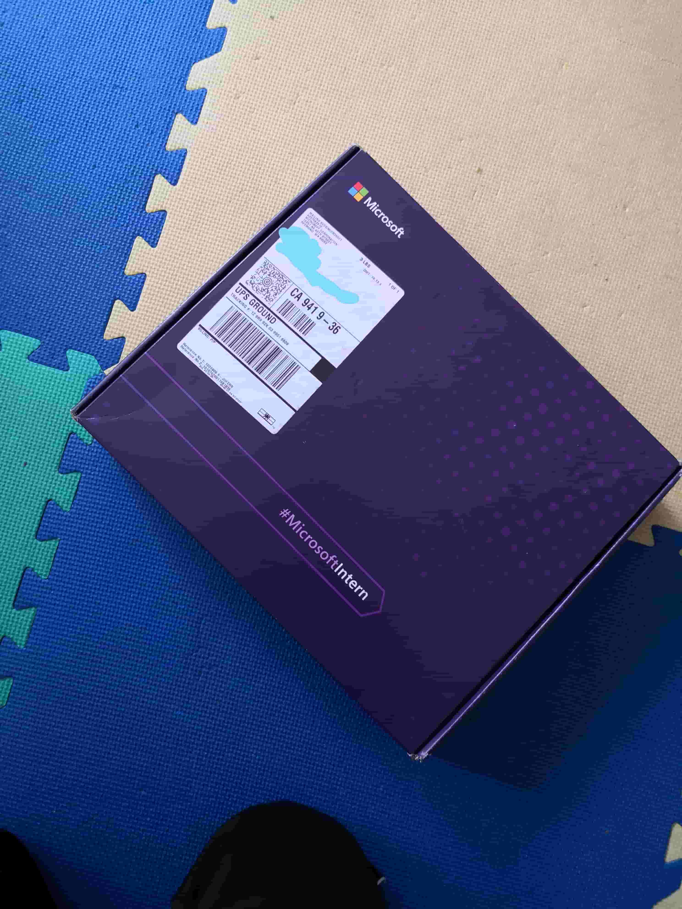
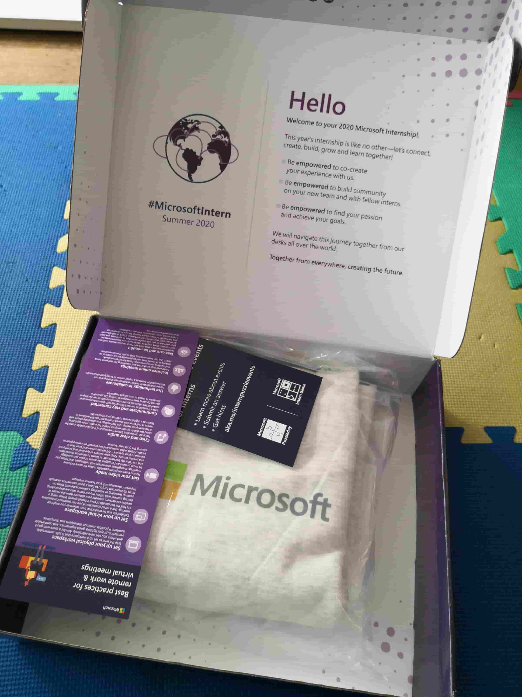
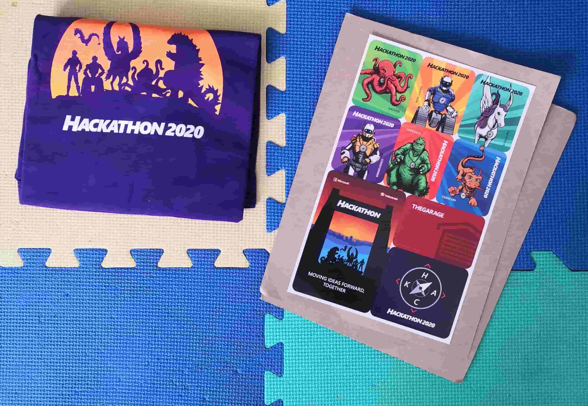
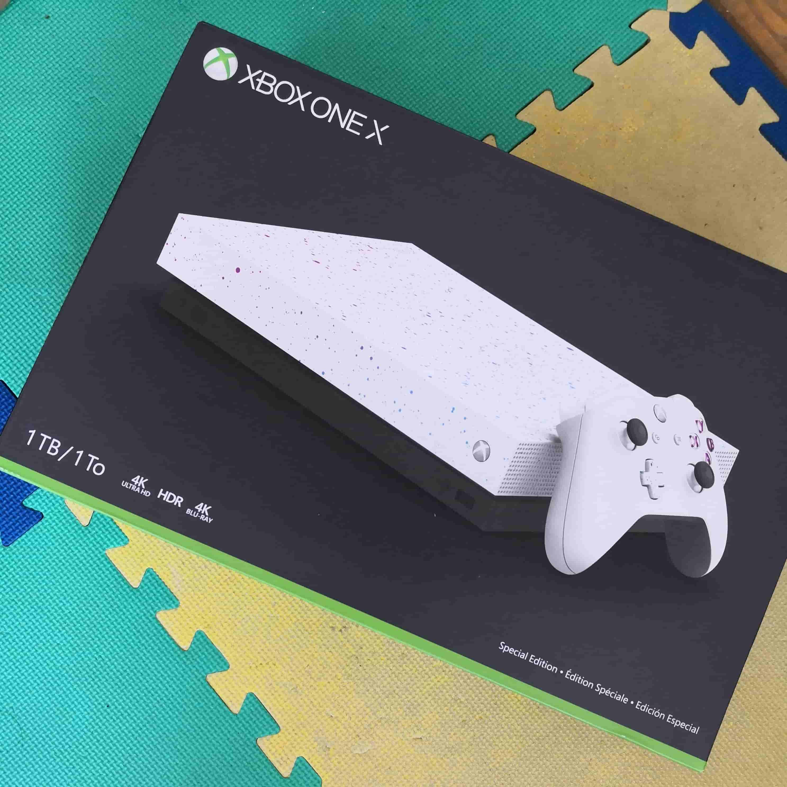

Over this past summer, I was a software engineering intern at Microsoft on the Surface Duo (their new folding phone!) firmware team. I was working remote from home in San Francisco, but my team was nearby in Sunnyvale, CA. I'll go over my remote intern experience, including the fun stuff and the work stuff. There aren't that many posts like these out there for the remote experience and I think they're super valuable when evaluating internship offers and getting way too hyped for the summer. It looks like Summer 2021 will also be remote too, so here's a baseline of what to expect for a remote internship experience at Microsoft! Of course your results may vary. 

# Interviews
Now the interviews weren't really part of the internship experience, but my interview process was a bit different and sort of rolled over into my internship experience a bit. 

I actually had my first round interview in January 2020 and my Super Day on-site interviews in February for my specific team at my team's office in Sunnyvale. This is actually pretty rare, most interviews happen between September and November and are typically put into a general intern pool. The two other interns on my team followed the standard application process. The team matching process happens way later closer to the summer so many interns don't really know what exact team they're on or their manager until closer to the summer. In fact, I heard that some people didn't even know who their manager was until a few days into their internship. 

Luckily I knew my team and manager from my interviews. I forgot to ask why my interview process was so different, so I guess we will never know. My best guess was that I was probably wasn't on the first-choice list, but after some people declined their offers in Decemember, Microsoft started to reach out to second-choice list and got to me. 

# Pre-Internship

I guess the "pre-internship" period encompasses the time after I accepted my offer to when my internship actually started which lined up pretty well with Covid first hitting the US, so there was a lot of uncertainty. Internships were getting cancelled left and right as companies rushed to get everything in place for the summer. 

Microsoft also held some informational events before the summer to help interns and new grads get familiar with Microsoft and the surrounding areas, stuff like:

- Meet Microsoft Devices
- Exploring Seattle
- Program Management at Microsoft

## Uncertainties

I think Microsoft did a great job in handling everything during this period of uncertainty and confusion. We were scared that like [Workday, AirBnB, Yelp, and a ton of other companies](https://ismyinternshipcancelled.com/?company=&status=yes), our internships woud get cancelled. We were also hearing that other companies were transitioning to a remote internship. It would really suck if, for example, I declined an offer from a company that confirmed remote internships and Microsoft cancelled their internships. 

Luckily, Microsoft kept us updated with weekly emails about any updates on the intern program. They sent surveys asking us for our summer plans like where we would be located and also promised dates on bigger announcements. Sometimes, the emails wouldn't contain any new info, but it was still reassuring and I really appreciate Microsoft's dedication to this. 

It was also kinda funny because the some people got their emails earlier than others, so someone would ask in the Slack like "oh did you guys see the new email??" and then like 50 people would respond instantly asking "what email??" "I didn't get anything yet!!" and those sort of things. 

One of the emails indiciated that they would make their announcement on the status of the internship at some specific day. Well when that day rolls around, we get radio silence and suspense all day. Most of the other emails would get sent out around working hours PST, so we expected a similar timeline for the big announcement too. Well we finally get the email at like 10PM PST confirming remote internships, but only for US and Canada interns, everyone else got their internships cancelled with a few accomodations. 

## Offer Changes

For US interns, we had our housing stipend reduced from $7000 to $3500 and we lost our transportation/relocation benefits. Other than that, our compensation remained untouched. Some people were upset because they had already made housing plans for the summer and paid some deposits upfront. Others were upset because other companies that they may have declined offers to were offering the full compensation package, or as much as possible. Others were grateful that we still had a summer job, espeically under a crashing economy. 

I think these reductions were justified for the most part. We weren't going to be on campus, so the transportations/relocation benefits getting removed entirely made sense. The housing stipend getting cut in half helped to recoup some of Microsoft's losses because I heard they reserve and pay for the intern housing ahead of time before Covid, so they just lost a ton of money there. 

We also couldn't change our start dates either. This kind of sucked for me because I had a two-week trip to Europe planned after my brothers and I got off school, but that obviously got cancelled. Unfortunately, I couldn't move my start date up, so I sort of just had a two-week gap between my final exams and my internship. My start date was June 25th and at this time, most of the other interns, like those that attend semester schools, were already halfway done with their internships. 

## Equipment

On the bright side for starting later, I had more time to get my equipment sorted out. I heard that some interns didn't receive their equipment until their first or second week due to shipping delays ands stuff so luckily I was safe from that. The Microsoft admins tried to time the equipment so that it arrived the Thursday before your start date, but there were some difficulties in achieving that. 

Typically, a business admin (BA) reached out to the interns to coordinate the equipment and everything. Sometimes, it's the team's BA but I also coordinated with I think by CVP's BA. 

Most interns recieved a similar workstation setup: 
- Thinkpad or Surface Laptop, iOS devs got Macbooks
- Keyboad + Mouse
- Thinkvision Monitor
- Dock

And if you were lucky, you got other goodies like headphones and/or extra monitor(s). 

I personally got a Surface Laptop 3 laptop with I think max specs, a generic Microsoft keyboard + mouse, and a ThinkVision 27" monitor as part of the standard intern workstation package. For my org/team, I received a Micorosft Pen, Surface Book 3, Surface Headphones, and a Surface Duo prototype/dev board.

### Surface Jet 3

I also got a Surface Book that was specific to my work. I was working on the Surface Duo, so I needed a machine to do Android builds. Android OS builds require Linux so my team gave me an extra laptop with Ubuntu to do all the Android builds. 

I'm not going to lie, that Surface Book + Ubuntu was one of the jankiest machines I've ever used, it just wasn't an optimized combo and the Surface Book has tons of cool features that Ubuntu couldn't handle and would just explode. For example, the Surface Book has a touch screen, but that touch screen just didn't work when running Ubuntu. The Surface Book also has a cool feature that lets you detach the screen, but when I tried that, the laptop would just freeze. The laptop would also occasionally freeze or drop internet connection and I'd just need to reboot the laptop, which got annoying. 

Also, in the middle of the night, for whatever reason, the laptop would reboot itself or something and I guess the laptop doesn't know what idle is because the fans would just go on full blast in the middle of the night. I worked from my bedroom, so as you can probably tell, this was kind of annoying. 

The laptop also didn't know what idle mode is and I guess only had two fan speeds, off and 400%. When I turned on the laptop, it would just sit in the login screen and do nothing, not go to sleep or anything. That would be fine, but I guess the thermal management didn't exist or something because 10 minutes later, the fans would be running at 400% and the chassis was hot to the touch. And this was under no load, just sitting at the login screen after a reboot. 

I can't really blame Microsoft or Ubuntu or anything since neither was really made/optimized to run on the other, but that made me realize how much we take for granted the amazing experience of *most* laptops and how much work goes on behind the scenes in addition to just smacking together some good specs and calling it a day. 

### Surface Headphones

I was one of the lucky interns that received a pair of Surface Headphones. I was told to keep the boxes for the headphones since I'd need to return them. Some interns got other headphones, others didn't get any headphones at all. 

Apparently all the interns under my CVP got Surface Headphones, but funny enough the full-time engineers (FTEs) didn't. Well most of the FTEs on my team got other headphones, but one of the FTEs that started a few weeks before me actually got the Surface Headphones. 

I'm actually a pretty big techie so I was pretty hyped about the Surface Headphones. They were the first gen, I think the second gen was released a few weeks before I received mine. I used to use the Bose QC35ii's and the Sony WH1000-XM2 ANC headphones, but I really liked the Surface Headphones. I'm not an audiophile so I can't really tell the difference in sound quality too much, but I noticed that my Sony's had more bass. This was especially apparent because I listen to really bass-y music but I didn't mind too much. The ANC on the Surface Headphones isn't as good as the Sony's or the Bose, but that didn't matter for me too much since I was usually at home in my own room. I really like the overall user experience a lot more on the Surface Headphones. 

### Dock

I think the [Surface Dock](https://www.microsoft.com/en-us/p/surface-dock-2/8qd908364sg2?activetab=pivot%3aoverviewtab) was also part of the standard intern workstation and it was actually pretty cool. I didn't really know what a "dock" was before I got one since I usually just stuff directly into my laptop or monitor. I don't have a picture of the dock set up and everything, so here's the best I can do: 

It's just a small, deceptively heavy black box that plugs into the Surface Laptop's/Book's proprietary charging port and breaks out stuff like USB (but not USB-C), HDMI, ethernet, etc. You basically need to plug in only the proprietary charging cable (which is magnetic) and all your mice/keyboard, monitor, everything else gets easily connected to your laptop. This was super convenient for me because I had two laptops and swapped between them, so the dock made that process super easy and fast. 

### Returning/Keeping Equipment

Some interns got to keep some of their equipment, others didn't get to keep any, it seemed team/org dependant for the most part. Some interns got to keep their monitor(s) and mice + keyboard, but some had to return everything. I'm sure everyone had to return their laptops. 

I was lucky in that I got to keep my Surface Headphones (which I was told I needed to return), mouse + keyboard, and Surface Pen. I still have my Surface Pen but I don't have any use for it since it requires special screens that utilize Microsoft proprietary tech. 

I needed to return my laptops and monitor. Most interns needed to pack everything up and ship it out, but on my last day, I went into office and dropped everything off which was way more convenient.

# Swag

Ok now time for the most decisive factor when deciding between internship offers. Some swag was intern-wide, others were team/org dependant. Either way, Microsoft offers a ton of awesome swag like clothing, food, tech, and other goodies. Some interns also received swag during their interviews, but I didn't so it won't be included here. 

Some swag was known beforehand, but other swag, especially the team/org specific swag, was straight up an actual surprise. For some people, their team/org swag would just show up on their doorstep one day. I have Fedex and UPS accounts, so whenever something is shipped to me, I get notified that a package is arriving, who sent the package, etc. I remember getting a few notificaions that an unexpected package was being shipped to me, so I got pretty hyped for a few days looking forward to that top secret swag.  

## Intern-Wide 

Some swag was given, or at least available, to every intern. I'll include event-based swag as well if the event was available to every intern.

### Intern Giftbox

Every intern received at least one intern giftbox that included a white Microsoft sweater, a Microsoft insulating coffee bottle, and a puzzle all shipped in a cool little Microsoft Intern box. I think an external service put together these boxes and everything.

I think the intern gifts were supposed to arrive around the start date for each intern, but it ended up getting pretty delayed. I received mine in late August and some interns didn't even get theirs until after they ended. 

### Hackathon Swag

I'll talk more about the Microsoft Hackathon and Intern Day in the Fun Stuff section, but here's the swag. Everyone that signed up with a team for the hackathon got a dope Microsoft Hackathon 2020 t-shirt and stickers. I think the Hackathon might be themed so every year, each shirt has a differnt theme, but I'm not 100% sure. 

### Intern Day Swag

I'll go more into Intern Day later on as well, but we had a choice between three items, all of which were Microsoft labeled:

- Backpack
- Mug
- Lunchbox

Like the intern giftbox, I think an external service handled these gifts as well.  

## Org/Team-Specific 

Some orgs and teams also offered their own swag in addition to the intern-wide swag. I was on the Surface Duo firmware team which is under Surface, which is under Experience + Devices (E+D). I think E+D is the org, so I'm not sure what to call the Surface "org", which is in E+D, maybe it's the division?? I think Experience is the Windows side of things and of course Devices is Microsoft's hardware lineup including the Surface products, but not Xbox since I think that's in its own org. 

### Experience + Devices

E+D had some pretty cool swag, mainly the Xbox One X. I actually got my Xbox in the middle of my quarter way before my internship started since Microsoft wanted to send out all the Xboxes at the same time.

We also got an intern swag package that included a Microsoft Devices t-shirt, pen, notebook, stickers, and mug. 

### My Team

I think all the interns under my same CVP got to keep their Surface Headphones, keyboard + mouse, and Microsoft Pen so I'll go ahead and count that as swag. I also received a dope Surface Duo hoodie from my team. 

### Other Teams

The Xbox and Surface Duo hoodie were specific to my team/org, and other teams/orgs had their own swag. A lot of the swag was branded with the org logo too. Here are a few things other teams/orgs offered. I'd throw in some pictures but unfortunately Slack deleted them. 

- Hoodies
- Backpacks
- Seattle gift bags with food and other local goodies
- Masks
- Blankets
- Stickers
- T-shirts
- Beanies/hats

# Fun Stuff! 

Microsoft really sells the interns on the whole Microsoft experience and offers tons of fun events throughout the summer. It would of course be better if we were in-person, but I still had a blast throughout the remote experience.

## Intern Cohort

Microsoft has intern cohorts every summer which is basically just a group of random interns paired with a few FTEs who organize and facilitate activities for the interns. My cohort had I think like 2 FTEs and ~30 interns or so, but 75% of them never showed up for anything. We actually had a few activities with pretty good turnout, apparently other cohort groups had way more trouble getting any initial turnout and as a result never hosted any events. 

All the interns in my cohort started and ended at around the same time and I think we were all supposed to be in the SF Bay Area offices. The cohort leaders were both in the SF offices and most of the interns that showed up to events were in the SF and Bay Area offices. Coincidentally a lot of us were located on the west coast too. 

The intern cohorts also get a budget to spend on activities, which of course was more applicable during normal times. How this budget is spent depends on what the cohort leaders want to organize. For example, our cohort leaders spent their budget on local food/snacks the previous year when they were in person. This year, they spent a lot of the budget on giftcards they gave out for participating in the events to incentivize us to show up. 

### Game Nights

Game nights are sort of the obligatory remote social event. The two cohort leaders organized game days like once every week or two and we placed Skribble.io, Typeracer, and Jackbox. At the beginning of our internships, our cohort leaders sent out this massive list of online games we could play, but of our entire intern cohort, only around five usually showed up for these events. 

### Scavenger Hunt

This was probably my favorite intern cohort event. Our intern cohort had interns that were supposed to be in the SF Bay Area Offices, so our leaders wanted to get us a feel for the area with the scavenger hunt. They gave us a list of all the neighborhoods in SF and we had to find a few places/landmarks of the neighborhoods. For example, the Golden Gate Bridge goes with the Presidio and Ocean Beach goes with the Sunset. We weren't given the landmarks, only the neighborhoods so we had to find out each of the landmarks on Google Maps or whatever and set a screenshot as our Teams background for a group picture. 

Out of our entire intern cohort, I think only like five-ish people signed up (just my team and I), so our cohort leaders needed to invite other Bay Area intern cohort groups. In total, we ended up having three teams, around fifteen people. 

We had a weekend to find all the landmarks and gather our group pictures for the judges to determine the winners. The top three teams got Amazon gift cards, but there were only three teams so everyone got gift cards. I'm still not too sure how the winners were determined, but my team ended up getting last place lol. To be fair, we only go to like half of the neighborhoods so that might be why. 

Even though this event was remote, it was still a lot of fun. I feel like it would be more fun if it were in-person so we could actually go around the city to all the landmarks. It would probably take a lot longer since the city is pretty big but it would be a great experience for those new to the city. 

### AirBnB Experiences

I guess AirBnB was dying from the pandemic, so they launched this service called AirBnB Experiences where individuals or groups can sign up for tours and events. Maybe it was around pre-Corona, but I'm not too sure. For example, one of the events I remembered was a tour of a bee farm. We had a choice between a few events, so we picked out this "Magic and {food something}" event where a couple from South Africa showed taught us a few magic tricks and how to make a simple South African dessert. Halfway through, they cut off and it turns out they had a power outage. Apparently, their area of South Africa has scheduled rolling power outages to prevent overloading their electrical grid, but this power outage was unexpected. We ended up rescheduling and finishing the rest of the event later on. 

### Former Intern Panel

Our cohort leaders had been at Microsoft for a few years and led a few cohorts during the previous summers as well. They hosted an former intern panel with their old cohort interns, some of which returned as interns, others who returned as FTEs, and I think all were in the SF Bay Area offices. We had something like ten or so panelists but only like five interns.

## Intern Day

Every summer, Microsoft hosts Intern Day, celebratory event for the interns. I'm not sure if they have an Intern Day equivalent for off-season interns or not. Intern Day is usually hosted at or near the headquarters in Redmond, so they fly and house the interns from satellite campuses up to Redmond for a week. 

This year, Intern Day was also remote and we had a virtual concert with Gryffin and Chance the Rapper and inspirational talks with Malala, Melinda Gates, and Luvvie Ajayi Jones. We also got from free swag, a choice between a Microsoft branded mug, backpack, or lunchbox. Some of the interns were kinda salty about the swag because for previous years, Microsoft gave out Xboxes and max-specc'd Surface Laptops and stuff. 

## Hackathon

Every year during intern season, Microsoft hosts a week-long company-wide hackathon that both interns and FTEs can join. Upon joining a team, they'll send out swag like a dope t-shirt and stickers. FYI they only send out the swag while supplies last, but I signed up for a team like a few days before it started and I got my swag no problem in a few weeks. 

I don't think the teams have a size limit so our team had like ten people, but people contributed based on their work schedules. There's also this internal site to find teams/projects to join and there are a few hackathon tracks as well. One of the tracks I remember was the Surface Duo track that challenged people to build an app or game to leverage the unique dual-screen experience. I've heard that hackathon winners are pretty legit some some of them even turn into bigger projects/products. 

## Puzzle Day

Apparently Microsoft has a pretty big puzzle culture, so every summer they host a Puzzle Day event, a couple-hour event where we try to crack some puzzles. I think this event might be open to FTEs as well. There might've been a prize for the winners, but my team wasn't even close to winning so it didn't much matter. I'm pretty bad at puzzles so some of them were super difficult. I think they're submitted my Microsoft employees and most of them had multiple stages. For example, I think one puzzle had a crossword puzzle, but you took the answers from the crossword puzzle into another sub-puzzle which would be used again to get the final answer. There were also meta-puzzles that required multiple other full puzzles to be completely solved. 

## Co-Creation

Not gunna lie I still don't really know what co-creation is, but it has something to do with using Microsoft as a platform for your passions or something. I think interns set up events like diversity exec chats and music/dance videos and stuff through co-creation, but I can never be sure. 

Most of the events didn't interest me too much, but there was this one small thing that I think was set up through co-creation. A lot of interns were worried about the limited networking/social opportunities with other interns because of the remote internships, so there was this "meet other interns" survey thingy where based on our survey results, they would pair us up with 3 random interns who filled out similar answers. The survey had these casusal buzzfeed-style questions like "how many unread emails do you have right now?" and "you see a cute intern at a party what do you do?" and stuff like that. There were other opportunities to socialize with other interns, but this one felt more randomized yet more personal because they'd match you up with random interns throughout the company that probably aren't in your social/work group and the type of questions more uniquely captures your personality. 

# Work Experience

I can't get too much into my work experience because there's a ton of confidentiality around the Surface and Duo stuff. I think all Microsoft interns have a mentor and a manager. The mentor is there to help more on the technical/day-to-day work while the manager is more for like manager stuff. My manager was also the team's manager, so he also managed the two other interns and half of the team. All of the interns on my team had their own mentor, but I'm not sure if this is the case for all Microsoft interns. I was closest to my mentor and talked most with him and I think that's generally the case. 

I worked on the Surface Duo software and had two projects. My first project took me about 7 weeks but I'm not sure if this project was supposed to take up all 12 weeks. When my mentor introduced the project, he projected it to take only 3 weeks but I ran into a good number of issues that messed up the timeline. I think my manager mentioned that I finished the projects a few weeks early, so that leads me to believe that the project was projected to take all 12 weeks. Either way, I always mention that I finished my projects 5 weeks early during interviews lol. 

I was also given a Duo dev board to do all my dev on. The dev board for the Duo has all the PCBs and electronics exposed for debugging, along with some additional debug hardware. It's also not assembled into the standard phone chassis, it's sort of all open in a custom rig so we can access all the electronics.

I was actually pretty surprised and excited about this because at Apple, we were pretty secretive about unreleased products. There's the of course issue of the unreleased product getting leaked, but also I heard that many of these prototypes also have non-production electronics. For example, the non-prod SoC may be 99.9% ready for production (meaning it's not really a "prototype" or anything), but there are some changes in the silicon to make it easier for engineers to debug. The SoC stores lots of top secret encryption keys and these keys are phyisically impossible to read on prod chips because the chips are fused at the silicon/chip-level in a certain way to ensure that the keys can't be written/read. If someone gets a hand on these keys and know what they're doing, they may be able to bypass some of the encryption that keeps our devices secure. On dev chips, these keys may be readable to help with debug, so it's important to keep it out of the hands of the wrong people. That was just an example, there may be more stuff like that but I'm not even sure how common the encryption thingy actually is. 

## Projects

My first project was a device driver for a sensor. It actually got commercialized and I was working on the production code which was super cool. I'm super into smartphones and stuff so it was awesome to finally get to work on one and explore everything behind the scenes, especially with my fingerprints on the final product. I was super lucky to get a high-impact, commercialized project, not all interns get this type of opportunity. 

Within the Surface Duo FW team, there are smaller "subteams" that work on specific subsystems of the phone. For example, there might be a few engineers working on the camera, battery, wireless, UEFI, etc. I worked alongside 4 other engineers, including my mentor and another engineer form Taiwan who joined a few weeks in. 

I think the device driver was a great first project given my hardware background. I'm pretty sure this was entirely intentional and I really appreciate my team giving me this opportunity. I actually ran into some hardware issues so my hardware background actually came up a few times. It's not easy to debug hardware issues at home, so I needed to go into office a few times for some rework and equipment. 

After I wrapped up my first project, I started my second project, an app to configure settings in the modem. The modem has like 80,000 settings to configure random stuff like network bands and all that cellular RF stuff. I built an android app and did some work on the Java framework libraries and native libraries to get the app to talk to the modem. 

At the end of my internship, I also presented my projects to my team and my manager's manager's manager's manager with other interns. I remember on the day of my presentation with my manager x4, we had some pretty bad forest fires in the Bay Area and the sky was orange like something out of Blade Runner.  

## Work Hours

# Networking Opportunities

With remote internships, it's much more difficult to get the same social/networking experience with other interns, FTEs, and the team and local lockdowns didn't help the situation. Luckily Microsoft holds a ton of intern/social events to meet other interns and FTEs. Here, I'll focus more on networking opportunities with other FTEs. 

## Reaching out to Randos

Microsoft has this cool culture around interns so all the FTEs are super helpful to interns. Sometimes that means reaching out to a relevant FTE for technical help, but also reaching out to random FTEs to schedule chats and learn about them, their work, and more about the company. Interns can easily be identified by their special email alias and Teams also shows every employee's position. I thought this was strange at first because my previous internship advertised that interns were treated like FTE, so if someone didn't know that you were an intern, there wasn't an easy way to discover that. 

I was heavily encouraged to reach out to random FTEs and schedule quick chats with them to learn more. I don't remember where I got this from, maybe it was from the Slack/Discord or random videos/articles/blog posts online, but multiple sources highly recommend I take advantage of it. I would pass this encourgement to new interns, especially since this was my favorite FTE networking experience. 

As interns/college students, we know very little and Microsoft has many engineers who have been working for longer than I've been alive, so it's super cool to get new insights from them about random stuff. They can also be a good resource to learn more about the company or area. Additionally, this is a unique way to expand your Microsoft network and find a new team to return to. Once you leave, you no longer have access and FTEs won't be as responsive to randos so these are great opportunities to leverage while still an intern.

I first starting reaching out to other hardware/electrical engineers (HWE/EE) on the Surface Duo since that's what I was most interested in. At the end, I'd ask for more people to reach out too, specifically those who were experts in my fields of interest, and sort of expand from there. I stuck primarily to within Surface hardware (HW) since that's where a good amount of the EEs worked in and many of them already know each other, so when I asked for more people to reach out to, they usually suggested people within Surface. 

Other interns found completely random FTEs to reach out to by literally picking a random name out of the org chart. Microsoft has org charts where you can sorta see the hierarchy of the whole company with each individual employee. The org chart is built into an internal site and Teams, but the Teams org chart UX is way better. 

## Microsoft-Organized

Microsoft hosts tons of networking opportunies, some of which are more formal that require some sort of registration, others of which are more casual or pre-assigned. 

### Coffee Chats

Additionally, Microsoft hosted a Coffee Chats program (this might've been a co-creation project) where interns and FTEs sign up and get paired up one-on-one based on similar interests. For example, I mentioned that I'm studying EE, so I got paired up with a few SWEs with HW backgrounds. The Coffee Chats were hosted once every two weeks for eight weeks I believe. It's possible the program ran for longer, but I started a bit later so my experience could've been cut short. 

### Intern Buddy 

I think Microsoft has two programs called "intern buddy", but to be fair like every company has an "intern buddy" program. I think at Apple it's called like iBuddy or something but I'm not sure if that's just a meme because I've never heard it around. 

My first intern buddy was a teammate who I could reach out to with any questions. Maybe this wasn't actually called "intern buddy", I don't really remember lol. He recently joined out of college so he was more familiar with the onboarding process and the transition from school to work. I think he was the only new grad on the team so I'm not sure if he was also the other interns' buddy. 
### Misc
# Training Videos

A ton of companies have required empoyee training on stuff like diversity and confidentiality. Sometimes these trainings are more involved and have quizzes, videos, and reading articles like online school. For some reason, one of the training videos was like a TV show or movie with SUPER high production quality with good lighting, acting, cameras, etc. They literally opened with "last time on {the training video's series name}" and did a quick recap for previous episodes/seasons (they were on like season four or something for my required training). I think this was the confidentiality training and it was pretty entertaining just like a regular TV show. 

# Returning

Internships are great opportunities to explore different career paths, especially since interns have so much mobility and can intern a few months at a time without any consequences. I've been coding for about nine years when starting my internship and I've always been super passionate about coding and building things, but this internship led me to discover that software engineering isn't where I want to take my career. There's a big difference between writing software on your own and writing software with a team to be used by millions of people and I'm glad this internship gave me that experience. I still love coding (I mean check out my green boxes on GitHub lol) and I don't forsee that passion dying anytime soon. I personally find a career in hardware/electrical engineering much more fulfulling for me at the moment so that's where I'm taking my career. If my passions or circumstances change in the future, I can always switch out of hardware engineering (HWE) into software engineering (SWE), but going from SWE to HWE is unheard of. 

I actually kinda had imposter syndrome for like the first time and didn't think my performance was up to par. Maybe this was because of the remote internship experience or I continuously compared myself to my previous internship performance and experience, but I ended up getting a return offer to join under my manager x4's group and had strong feedback from my mentor and manager. I heard that like 80% of interns get a return offer and you have to try really hard to not get a return offer so don't sweat it too much. 

If I do return to Microsoft, it would be somewhere in their hardware groups like Surface/Devices, Xbox, Hololens, or Azure hardware. Microsoft has a few hardware teams in the SF Bay Area (which is where I plan to start my career) for Hololens, Azure, Surface, and Xbox and a brand new Microsoft campus in Mountain View is opening up for Microsoft to expand their Silicon Valley presence. Unfortunately, after applying online, I was promptly rejected from *every single* position I applied to, so it looks like I'll need to wait until next year to apply again, maybe with some nepotism.

# Final Thoughts

Whether I'm returning or not, I'm still super grateful for the awesome internship experience over the past summer. I worked on a great team on a super cool product and I learned a ton. My mentor, manager, and teammates were super helpful throughout my entire internship and I really enjoyed working with them. I had a ton of fun with my intern cohort and other interns and I really appreciate all the effort my cohort leaders put in so we could have an awesome summer at Microsoft. Microsoft is an amazing company with a great culture and awesome engineers nd I'd definitely want to return to Microsoft sometime in the future (if they stop rejecting me). 

Want more insights? Check these out as well! 

- [Microsoft Explore Internship: A Remote Experience Self-Reflection](https://medium.com/@kendallnakai/summer-intern-reflections-ee432dc3c364)
- [How Was Microsoft's 2020 SWE Internship?](https://www.reddit.com/r/microsoft/comments/jl9429/how_was_microsofts_2020_swe_internship/)
- [microsoft-internships](https://github.com/CourtneyThurston/microsoft-internships)

# Glossary

I use a few acronyms and Microsoft nomenclature that I'll try to list out here in alphabetical order. 

- BA - Business Admin: A FT employee that handles a lot of the business stuff like organizing equipment
- EE - Electrical Engineer
- FT/FTE - Full-Fime/full-Time Engineer: Full-time employees, not interns
- HW/HWE - Hardware/Hardware Engineer: I usually use this synonomously with EE here
- Skip [Manager]: Your manager's manager. Often referred to as just "skip" or "skip manager"
- SWE: Software Engineer
- [Microsoft] Teams: Microsoft's version of Slack + Zoom, a chat app with video/voice chat
- XVP - Some Vice President: Senior management position, usually pretty high up the hierarchy because Microsoft is a big company. X = C (corporate), E (executive), S (senior), and probably more