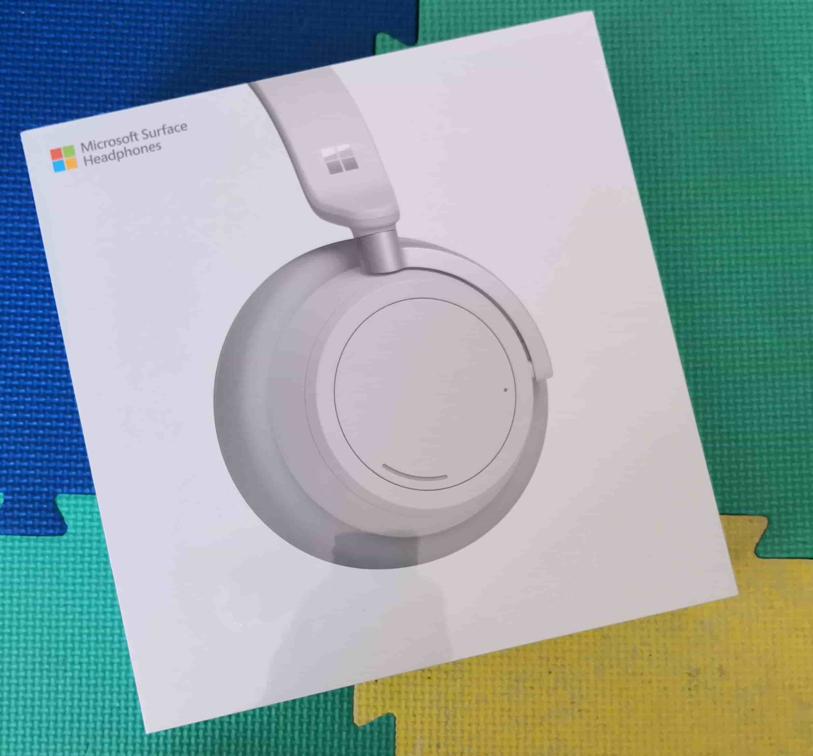
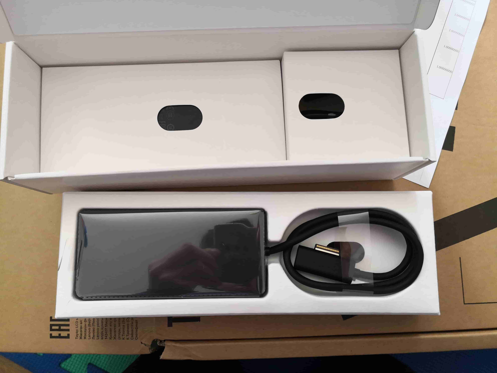

Over this past summer, I was a software engineering intern at Microsoft on the Surface Duo (their new folding phone!) firmware team. I'll go over my remote intern experience, including the fun stuff and the work stuff. There aren't that many posts like these out there and I think they're super valuable when evaluating internship offers and getting way too hyped for the summer. It looks like Summer 2021 will also be remote too, so here's a baseline of what to expect for a remote internship experience at Microsoft! Of course your results may vary. 

# Interviews
Now the interviews weren't really part of the internship experience, but my interview process was a bit different and sort of rolled over into my internship experience a bit. 

I actually had my first round interview in January 2020 and my Super Day on-site interviews in February for my specific team at my team's office in Sunnyvale. This is actually pretty rare, most interviews happen between September and November and are typically put into a general intern pool. The two other interns on my team followed the standard application process. The team matching process happens way later closer to the summer so many interns don't really know what exact team they're on or their manager until closer to the summer. In fact, I heard that some people didn't even know who their manager was until a few days into their internship. 

Luckily I new my team and manager during my interviews. I forgot to ask why my interview process was so different, so I guess we will never know. My best guess was that I was probably wasn't on the first-choice list, but after some people declined their offers in Decemember, Microsoft started to reach out to second-choice list and got to me. 

# Pre-Internship

I guess the "pre-internship" period encompasses the time after I accepted my offer to when my internship actually started which lined up pretty well Covid first hitting the US, so there was a lot of uncertainty. Internships were getting cancelled left and right as companies rushed to get everything in place for the summer. 

## Uncertainties

I think Microsoft did a great job in handling everything during this period of uncertainty and confusion. We were scared that like [Workday, AirBnB, Yelp, and a ton of other big companies](https://ismyinternshipcancelled.com/?company=&status=yes) our internships woud get cancelled. We were also hearing that other companies were transitioning to a remote internship. It would really suck if, for example, I declined an offer from a company that confirmed remote internships and Microsoft cancelled their internships. 

Luckily, Microsoft kept us updated with weekly emails about any updates on the intern program. They sent surveys asking us for our summer plans like where we would be located and also promised dates on bigger announcements. Sometimes, the emails wouldn't contain any new info, but it was still reassuring and I really appreciate Microsoft's dedication to this. 

It was also kinda funny because the some people got their emails earlier than others, so someone would ask in the Slack like "oh did you guys see the new email??" and then like 50 people would respond instantly asking "what email??" "I didn't get anything yet!!" and those sort of things. 

One of the emails indiciated that they would make their announcement on the status of the internship at some specific day. Well when that day rolls around, we get radio silence and suspense all day. Most of the other emails would get sent out around working hours PST, so we expected a similar timeline for the big announcement too. Well we finally get the email at like 10PM PST confirming remote internships, but only for US and Canada interns, everyone else got their internships cancelled with a few accomodations. 

## Offer Changes

For US interns, we had our housing stipend reduced from $7000 to $3500 and we lost our transportation/relocation benefits. Other than that, our compensation remained untouched. Some people were upset because they had already made housing plans for the summer and paid some deposits upfront. Others were upset because other companies that they may have declined offers to were offering the full compensation package, or as much as possible. Others were grateful that we still had a summer job, espeically under a crashing economy. 

I think these reductions were justified for the most part. We weren't going to be on campus, so the transportations/relocation benefits getting removed entirely made sense. The housing stipend getting cut in half helped to recoup some of Microsoft's losses because I heard they reserve and pay for the intern housing ahead of time before Covid, so they just lost a ton of money there. 

We also couldn't change our start dates either. This kind of sucked for me because I had a two-week trip to Europe planned after my brothers and I got off school, but that obviously got cancelled. Unfortunately, I couldn't move my start date up, so I sort of just had a two-week gap between my final exams and my internship. My start date was June 25th and at this time, most of the other interns, like those that attend semester schools, were already halfway done with their internships. 

## Equipment

On the bright side for starting later, I had more time to get my equipment sorted out. I heard that some interns didn't receive their equipment until their first or second week due to shipping delays ands stuff so luckily I was safe from that. The Microsoft admins tried to time the equipment so that it arrived the Thursday before your start date, but there were some difficulties in achieving that. 

Typically, a business admin (BA) reached out to the interns to coordinate the equipment and everything. Sometimes, it's the team's BA but I also coordinated with I think by CVP's BA. 

Most interns recieved a similar workstation setup: 
- Thinkpad or Surface Laptop, iOS devs got Macbooks
- Keyboad + Mouse
- Thinkvision Monitor
- Dock

And if you were lucky, you got other goodies like headphones and/or extra monitor(s). 

I personally got a Surface Laptop 3 laptop with I think max specs, a generic Microsoft keyboard + mouse, and a ThinkVision 27" monitor as part of the standard intern workstation package. For my org/team, I received a Micorosft Pen, Surface Book 3, Surface Headphones, and a Surface Duo prototype/dev board.

### Surface Jet 3

I also got a Surface Book that was specific to my work. I was working on the Surface Duo, so I needed a machine to do Android builds. Android OS builds require Linux so my team gave me an extra laptop with Ubuntu to do all the Android builds. 

I'm not going to lie, that Surface Book + Ubuntu was one of the jankiest machines I've ever used, it just wasn't an optimized combo and the Surface Book has tons of cool features that Ubuntu couldn't handle and would just explode. For example, the Surface Book has a touch screen, but that touch screen just didn't work when running Ubuntu. The Surface Book also has a cool feature that lets you detach the screen, but when I tried that, the laptop would just freeze. The laptop would also occasionally freeze or drop internet connection and I'd just need to reboot the laptop, which got annoying. 

Also, in the middle of the night, for whatever reason, the laptop would reboot itself or something and I guess the laptop doesn't know what idle is because the fans would just go on full blast in the middle of the night. I worked from my bedroom, so as you can probably tell, this was kind of annoying. 

The laptop also didn't know what idle mode is and I guess only had two fan speeds, off and 400%. When I turned on the laptop, it would just sit in the login screen and do nothing, not go to sleep or anything. That would be fine, but I guess the thermal management didn't exist or something because 10 minutes later, the fans would be running at 400% and the chassis was hot to the touch. And this was under no load, just sitting at the login screen after a reboot. 

I can't really blame Microsoft or Ubuntu or anything since neither was really made/optimized to run on the other, but that made me realize how much we take for granted the amazing experience of *most* laptops and how much work goes on behind the scenes in addition to just smacking together some good specs and calling it a day. 

### Surface Headphones

I was one of the lucky interns that received a pair of Surface Headphones. I was told to keep the boxes for the headphones since I'd need to return them. Some interns got other headphones, others didn't get any headphones at all. 

Apparently all the interns under my CVP got Surface Headphones, but funny enough the full-time engineers (FTEs) didn't. Well most of the FTEs on my team got other headphones, but one of the FTEs that started a few weeks before me actually got the Surface Headphones. 

I'm actually a pretty big techie so I was pretty hyped about the Surface Headphones. They were the first gen, I think the second gen was released a few weeks before I received mine. I used to use the Bose QC35ii's and the Sony WH1000-XM2 ANC headphones, but I really liked the Surface Headphones. I'm not an audiophile so I can't really tell the difference in sound quality too much, but I noticed that my Sony's had more bass. This was especially apparent because I listen to really bass-y music but I didn't mind too much. The ANC on the Surface Headphones isn't as good as the Sony's or the Bose, but that didn't matter for me too much since I was usually at home in my own room. I really like the overall user experience a lot more on the Surface Headphones. 

### Dock

I think the [Surface Dock](https://www.microsoft.com/en-us/p/surface-dock-2/8qd908364sg2?activetab=pivot%3aoverviewtab) was also part of the standard intern workstation and it was actually pretty cool. I didn't really know what a "dock" was before I got one since I usually just stuff directly into my laptop or monitor. I don't have a picture of the dock set up and everything, so here's the best I can do: 

It's just a small, deceptively heavy black box that plugs into the Surface Laptop's/Book's proprietary charging port and breaks out stuff like USB (but not USB-C), HDMI, ethernet, etc. You basically need to plug in only the proprietary charging cable (which is magnetic) and all your mice/keyboard, monitor, everything else gets easily connected to your laptop. This was super convenient for me because I had two laptops and swapped between them, so the dock made that process super easy and fast. 

### Returning/Keeping Equipment

# Swag

# Fun Stuff! 

# Work Experience

Want more insights? Check these out as well! 

- [Microsoft Explore Internship: A Remote Experience Self-Reflection](https://medium.com/@kendallnakai/summer-intern-reflections-ee432dc3c364)
- [How Was Microsoft's 2020 SWE Internship?](https://www.reddit.com/r/microsoft/comments/jl9429/how_was_microsofts_2020_swe_internship/)
- [microsoft-internships](https://github.com/CourtneyThurston/microsoft-internships)
